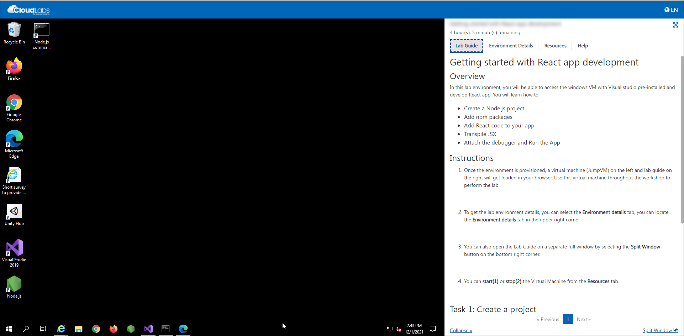
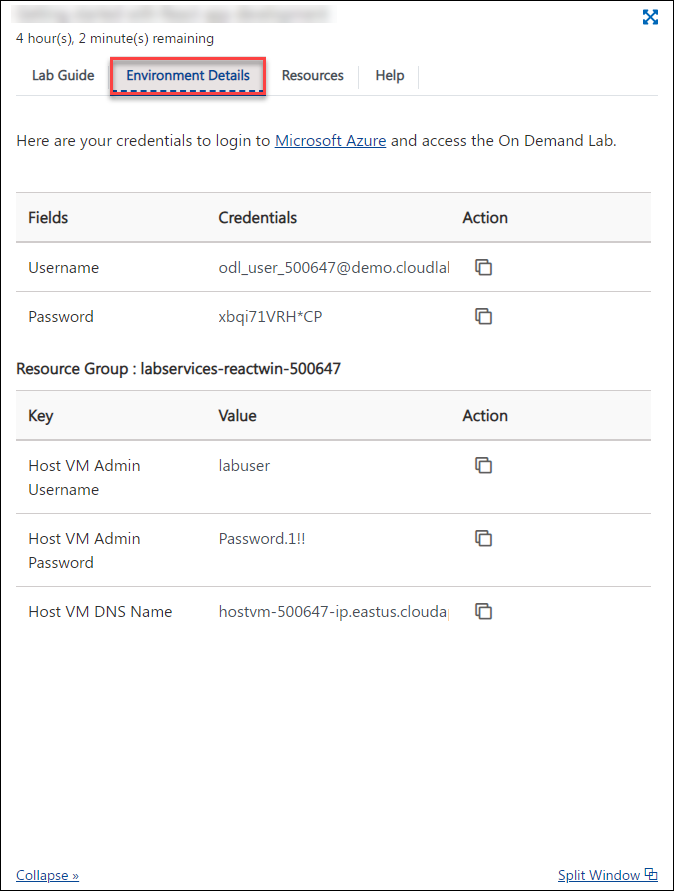
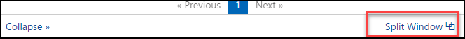
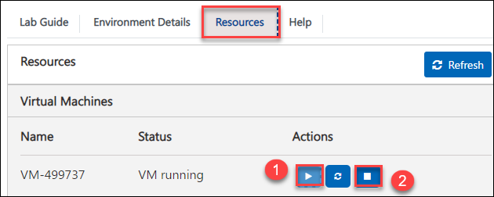

# Instituto Professional IACC | Hands on Lab	

This hands-on environment provisions the lab virtual machine pre-installed with tools like Android Studio, Anaconda, Java development kit(JDK), Eclipse, Mysql Workbench and Wamp Server required to perform the lab.

## Getting Started

1. Once the environment is provisioned, a virtual machine (JumpVM) on the left and lab guide on the right will get loaded in your browser. Use this virtual machine throughout the workshop to perform the lab.

   

2. To get the lab environment details, you can select the **Environment details** tab, you can locate the **Environment details** tab in the upper right corner.
   
   

3. You can also open the Lab Guide on a separate full window by selecting the **Split Window** button on the bottom right corner.
   
   
 
4. You can **start(1)** or **stop(2)** the Virtual Machine from the **Resources** tab.

   
   

