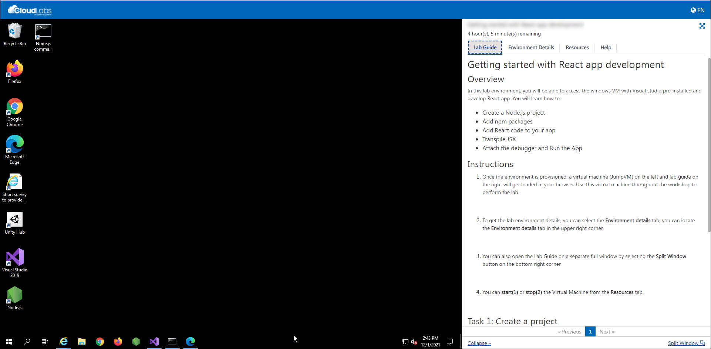

# NET 111 - Hands on Final Fall 2021

This hands-on environment has the lab virtual machine pre-installed with Hyper-V Manager and the required ISO files.

## Getting Started

1. Once the environment is provisioned, a virtual machine (JumpVM) on the left and lab guide on the right will get loaded in your browser. Use this virtual machine throughout the workshop to perform the lab.

   

2. To get the lab environment details, you can select the **Environment details** tab, you can locate the **Environment details** tab in the upper right corner.
   
   

3. You can also open the Lab Guide on a separate full window by selecting the **Split Window** button on the bottom right corner.
   
   
 
4. You can **start(1)** or **stop(2)** the Virtual Machine from the **Resources** tab.

   
   
5. The ISO files for the below images are pre-downloaded for you in the **C:\LabFiles\ISO** folder.
   - Windows 10 
   - Windows Server 2016
   - Windows Server 2019

