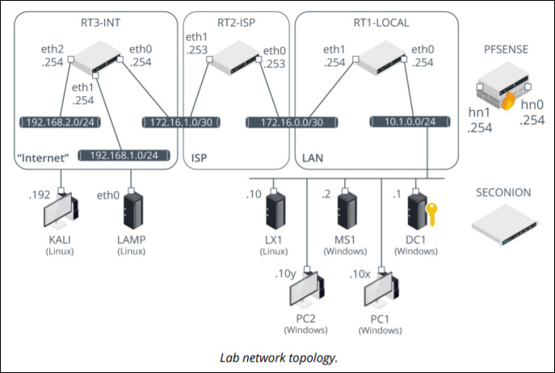

# CompTIA Labs : Network+

This environment is configured to provide sufficient hardware to carry out tasks directly and also test the impact of those changes without worrying about the pre-requisites required.

## Architecture diagram

Lab hardware for Network +

## Credentials for Guest OS

Use the following credentials for all the four guest operating systems.

1. DC1: 
- Username:515support\administrator
- Password:Pa$$w0rd
   
2. MS1: 
 - Username:515support\administrator
 - Password:Pa$$w0rd
 
3. PC1: 
- Username: Admin
- Password:Pa$$w0rd

4. PC2: 
- Username: 515support\administrator
- Password:Pa$$w0rd

5. LAMP: 
- Username: lamp
- Password:Pa$$w0rd

6. LX1:
- Username: centos
- Password:Pa$$w0rd 

7. KALI: 
- Username: root
- Password:Pa$$w0rd 

8. RT* VyOS Routers: 
- Username:vyos
- Password:Pa$$w0rd

9. PFSENSE:
- Username: admin
- Password:Pa$$w0rd 

10. SECONION:
- Username: administrator
- Password:Pa$$w0rd 
