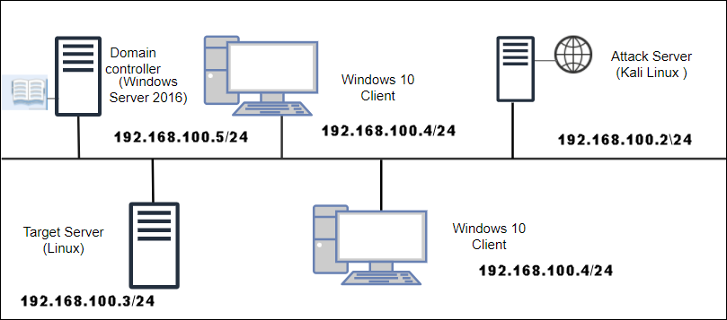

# CompTIA Labs : Security +

This environment is configured to provide sufficient hardware to carry out tasks directly and also test the impact of those changes without worrying about the pre-requisites required.

## Architecture diagram

Lab hardware for Security +

1. Windows Server 2016- AD Domain Controller
1. Windows 10 Client
1. KALI Linux Server
1. Linux Server

## Credentials for Guest OS

Use the following credentials for the following guest operating systems.
* **Username:** <inject key="Host VM Admin Username" />
* **Password:** <inject key="Host VM Admin Password" />

1. Windows 10 Client
1. KALI Linux Server
1. Linux Server and

1. Windows Server 2016- AD Domain Controller, use the following credentials
* **Username:** COMPTIALABS\ <inject key="Host VM Admin Username" />
* **Password:** <inject key="Host VM Admin Password" />

